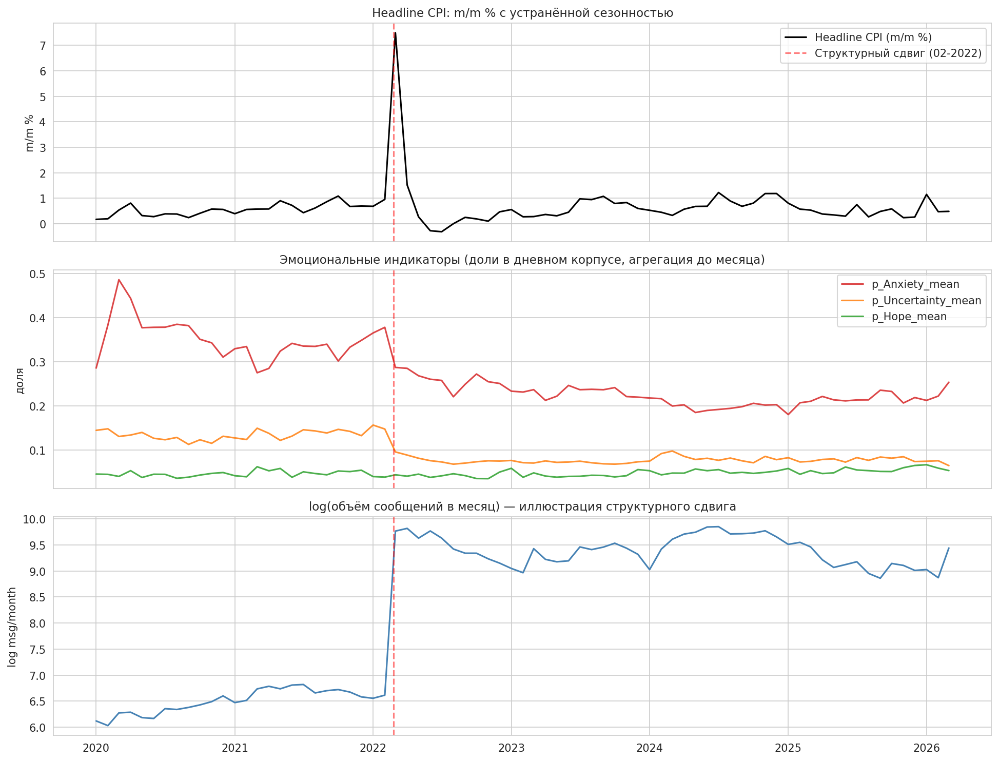
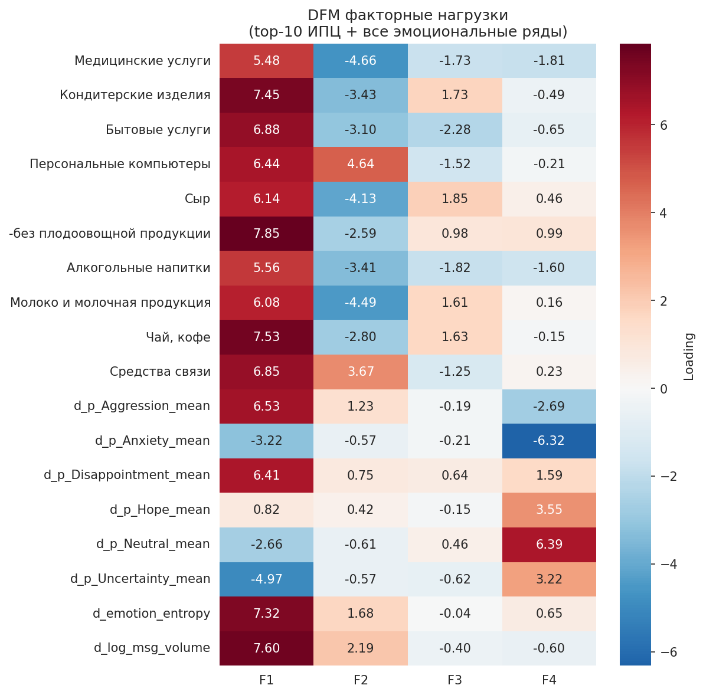
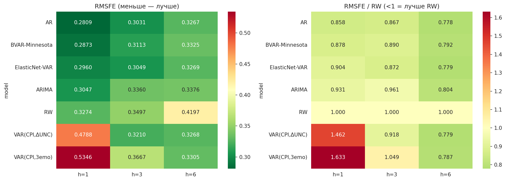

# Эмоции в Telegram и инфляция в России

Выпускная квалификационная работа. НИУ ВШЭ, факультет экономических наук, 2026.

**Автор:** Раднаев Булат Эрдэмович
**Научный руководитель:** Станкевич И. П.

---

## Вопрос исследования

Несут ли эмоции, выраженные в русскоязычных финансовых Telegram-каналах, опережающую
информацию о потребительской инфляции?

Вместо привычного деления на позитив и негатив тексты размечаются по шести классам:
тревога, агрессия, разочарование, надежда, неопределённость, нейтральность. Это
позволяет разделить состояния, которые в бинарной шкале неразличимы, но по-разному
связаны с инфляционными ожиданиями. Тревога направлена на конкретную угрозу,
неопределённость означает отсутствие у человека модели происходящего.

Период: февраль 2020 - март 2026, 74 месячных наблюдения.

---

## Данные

626 843 сообщения из шести финансовых Telegram-каналов, размеченных по шести классам
эмоций. Классификатор `rubert-base-cased-conversational` обучен на выборке из 9 583
текстов, размеченных GigaChat.

Качество классификатора: Macro-F1 = 0,651. Проверка переносимости между каналами
(обучение на пяти, тест на шестом): 0,666 ± 0,045.

Макроэкономические данные: темпы прироста потребительских цен м/м с устранённой
сезонностью, 54 категории товаров и услуг. Источник: Банк России.

---

## Результаты

**Эмоции опережают инфляцию.** Тест причинности по Грейнджеру:

| Индикатор | Лаг | p-value |
|---|---|---|
| Δ Неопределённость → ИПЦ | 2 | 0,003 |
| Δ Тревожность → ИПЦ | 4 | 0,018 |

Агрегированный негатив такой связи не даёт. Значимость появляется только после
разложения тональности на отдельные эмоции, и это главный аргумент в пользу
шестиклассовой разметки.



**Эмоции формируют отдельный фактор.** Динамическая факторная модель выделяет четыре
фактора. Четвёртый почти целиком эмоциональный: около 70% дисперсии его нагрузок
приходится на эмоциональные переменные. То есть эмоции не дублируют макроэкономические
ряды, а несут собственную информацию.



**Но прогноз это не улучшает.** Ни одна спецификация не превосходит случайное блуждание
статистически значимо (тест Диболда-Мариано, p > 0,05).



Отрицательный результат сохранён намеренно. Связь внутри выборки и улучшение прогноза
вне выборки это разные вещи: при 74 наблюдениях и шести эмоциональных рядах цена
оценивания дополнительных параметров превышает выигрыш от их информативности.
Эмоциональные индикаторы оказываются полезнее для понимания механизма формирования
ожиданий, чем для операционного прогнозирования.

### Гипотезы

| | Формулировка | Результат |
|---|---|---|
| H1 | Эмоции содержат информацию, не дублирующую макроряды | подтверждена |
| H2 | Отдельные эмоции опережают ИПЦ | подтверждена частично |
| H3 | Эмоции улучшают точность прогноза | не подтверждена |

---

## Структура

```
notebooks/
├── 1_classifier.ipynb      обучение классификатора эмоций
├── 2_data_prep.ipynb       агрегация в месячную панель, тесты стационарности
├── 3_dfm.ipynb             динамическая факторная модель
├── 4_granger_fevd.ipynb    причинность по Грейнджеру, FEVD, IRF
└── 5_forecasting.ipynb     прогнозы, тест Диболда-Мариано

data/
├── labeled_gigachat_6cls.csv       обучающая выборка, 9 583 текста
├── daily_emotion_indicators.csv    дневные доли эмоций по всему корпусу
├── monthly_panel_with_diffs.csv    итоговая панель для моделей
└── indicators_cpd.xlsx             компоненты ИПЦ, Банк России

figures/    графики из ноутбуков
docs/       текст ВКР и презентация защиты
```

Панель содержит 75 строк, но колонки первых разностей теряют первое наблюдение,
поэтому в моделях используются 74 месяца.

---

## Запуск

```bash
pip install -r requirements.txt
jupyter lab
```

Ноутбуки 2-5 работают на готовых данных из `data/`, не требуют GPU и запускаются
за несколько минут. Ноутбук 1 воспроизводит обучение классификатора, для него нужны
видеокарта и доступ к API GigaChat.

---

## Ограничения

- Шесть каналов не репрезентируют аудиторию Telegram целиком: подписчики финансовых
  каналов информированнее населения в среднем.
- Плотность корпуса выросла на порядок после февраля 2022 года, оценки за 2020-2021 годы
  менее точны.
- Метки получены языковой моделью. Проводился этап перепроверки спорных случаев,
  но сопоставления с человеческой разметкой нет.
- 74 наблюдения это малая выборка для многомерных динамических моделей.

---

## Цитирование

```
Раднаев Б. Э. Эмоциональные индикаторы в Telegram-каналах как фактор краткосрочного
прогнозирования инфляции в России: выпускная квалификационная работа.
М.: НИУ ВШЭ, 2026.
```

Код: лицензия MIT. Данные собраны из открытых каналов и публикуются в академических целях.
